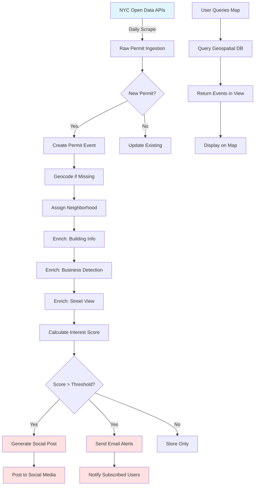
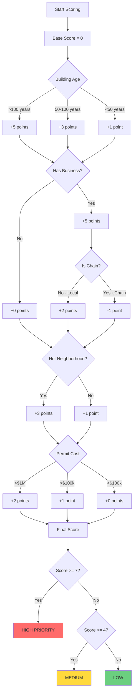
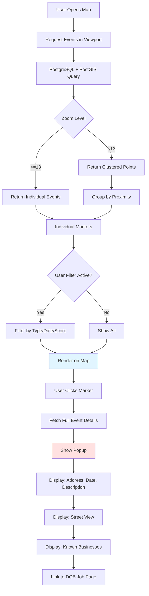

# Permit Pulse - Data Model Diagram

## Entity Relationship Diagram

```mermaid
erDiagram
    PERMIT_EVENT ||--o{ ENRICHMENT : has
    PERMIT_EVENT ||--o{ BUSINESS : "located at"
    PERMIT_EVENT ||--o{ SOCIAL_POST : generates
    PERMIT_EVENT }o--|| NEIGHBORHOOD : "in"
    PERMIT_EVENT }o--|| BUILDING_INFO : references
    
    PERMIT_EVENT {
        uuid id PK
        string event_type "demolition|new_building|alteration|liquor_license"
        string job_number UK "DOB job number"
        string address
        decimal latitude
        decimal longitude
        string borough
        uuid neighborhood_id FK
        date filing_date
        date approval_date
        date issuance_date
        string status "filed|approved|permitted|completed"
        integer interest_score "0-10 scale"
        jsonb raw_api_data "Full API response"
        timestamp created_at
        timestamp updated_at
    }
    
    DEMOLITION_EVENT {
        uuid permit_event_id PK_FK
        integer existing_stories
        integer existing_units
        string existing_use
        integer estimated_cost
        uuid building_info_id FK
    }
    
    NEW_BUILDING_EVENT {
        uuid permit_event_id PK_FK
        integer proposed_stories
        integer proposed_units
        string proposed_use
        integer estimated_cost
        string developer_name
        boolean is_luxury
        decimal cost_per_unit
    }
    
    ALTERATION_EVENT {
        uuid permit_event_id PK_FK
        string alteration_type "A1|A2|A3"
        string scope_description
        integer units_change
        integer cost
    }
    
    LIQUOR_LICENSE_EVENT {
        uuid id PK
        string serial_number UK
        string license_type
        string business_name
        string dba_name
        string address
        decimal latitude
        decimal longitude
        uuid neighborhood_id FK
        date filing_date
        date effective_date
        boolean is_chain
        string chain_category
        jsonb raw_api_data
    }
    
    BUILDING_INFO {
        uuid id PK
        string block
        string lot
        string bin "Building ID Number"
        integer year_built
        integer building_age
        string building_class
        integer assessed_value
        integer lot_area
        timestamp fetched_at
    }
    
    BUSINESS {
        uuid id PK
        uuid permit_event_id FK
        string name
        string place_id "Google Places ID"
        string business_type
        boolean is_chain
        string chain_name
        decimal rating
        string street_view_url
        jsonb google_data
        timestamp detected_at
    }
    
    NEIGHBORHOOD {
        uuid id PK
        string name
        string nta_code "Neighborhood Tabulation Area"
        string borough
        geometry boundary "PostGIS polygon"
        integer permit_count_30d
        integer permit_count_365d
        decimal gentrification_score
    }
    
    ENRICHMENT {
        uuid id PK
        uuid permit_event_id FK
        string enrichment_type "geocode|business|pluto|streetview"
        string source "google|nyc_api|manual"
        jsonb data
        decimal confidence_score
        timestamp enriched_at
    }
    
    SOCIAL_POST {
        uuid id PK
        uuid permit_event_id FK
        string platform "twitter|bluesky|mastodon"
        string post_text
        string image_url
        string post_url
        timestamp posted_at
        integer engagement_score
    }
    
    USER_ALERT {
        uuid id PK
        uuid user_id FK
        uuid neighborhood_id FK
        string alert_types "array: demolition,new_building,etc"
        boolean email_enabled
        boolean sms_enabled
        integer min_interest_score
    }
    
    USER {
        uuid id PK
        string email
        string phone
        decimal home_latitude
        decimal home_longitude
        integer alert_radius_meters
        timestamp created_at
    }
```

## Data Flow Diagram



## Enrichment Pipeline Detail

```mermaid
flowchart LR
    A[New Permit Event] --> B{Has Coordinates?}
    B -->|No| C[NYC GeoSearch API]
    C --> D[Update Event]
    B -->|Yes| D
    D --> E{Type = Demolition?}
    E -->|Yes| F[PLUTO Dataset]
    F --> G[Get Year Built]
    G --> H[Calculate Age]
    E -->|No| I[Skip PLUTO]
    H --> J[Google Places Search]
    I --> J
    J --> K{Businesses Found?}
    K -->|Yes| L[Store Business Info]
    K -->|No| M[Mark: No Business]
    L --> N[Check if Chain]
    M --> O[Calculate Score]
    N --> O
    O --> P[Street View Image]
    P --> Q[Complete Enrichment]
    
    style C fill:#fff4e1
    style F fill:#fff4e1
    style J fill:#ffe1e1
    style P fill:#ffe1e1
```



## Scoring Algorithm



## Map View Architecture



---

## Database Indexes for Performance

```sql
-- Spatial index for map queries
CREATE INDEX idx_permit_event_location 
ON permit_event USING GIST(ST_Point(longitude, latitude));

-- Time-based queries
CREATE INDEX idx_permit_event_filing_date 
ON permit_event(filing_date DESC);

-- Neighborhood queries
CREATE INDEX idx_permit_event_neighborhood 
ON permit_event(neighborhood_id, filing_date DESC);

-- Status queries
CREATE INDEX idx_permit_event_status_score 
ON permit_event(status, interest_score DESC);

-- Type queries
CREATE INDEX idx_permit_event_type_date 
ON permit_event(event_type, filing_date DESC);

-- Business lookup
CREATE INDEX idx_business_permit_event 
ON business(permit_event_id);

-- User alert matching
CREATE INDEX idx_permit_event_spatial_score 
ON permit_event USING GIST(ST_Point(longitude, latitude)) 
WHERE interest_score >= 4;
```

---

## Sample Queries Using This Model

### Get all high-interest demolitions in SoHo last 30 days
```sql
SELECT 
    pe.address,
    pe.filing_date,
    pe.interest_score,
    bi.year_built,
    bi.building_age,
    array_agg(b.name) as businesses
FROM permit_event pe
LEFT JOIN demolition_event de ON pe.id = de.permit_event_id
LEFT JOIN building_info bi ON de.building_info_id = bi.id
LEFT JOIN business b ON pe.id = b.permit_event_id
JOIN neighborhood n ON pe.neighborhood_id = n.id
WHERE pe.event_type = 'demolition'
  AND n.name ILIKE '%soho%'
  AND pe.filing_date >= CURRENT_DATE - INTERVAL '30 days'
  AND pe.interest_score >= 7
GROUP BY pe.id, bi.id
ORDER BY pe.interest_score DESC, pe.filing_date DESC;
```

### Find all permits within 500m of a location
```sql
SELECT 
    pe.event_type,
    pe.address,
    pe.filing_date,
    pe.interest_score,
    ST_Distance(
        ST_Point(pe.longitude, pe.latitude)::geography,
        ST_Point(-73.9942, 40.7282)::geography
    ) as distance_meters
FROM permit_event pe
WHERE ST_DWithin(
    ST_Point(pe.longitude, pe.latitude)::geography,
    ST_Point(-73.9942, 40.7282)::geography,
    500
)
  AND pe.filing_date >= CURRENT_DATE - INTERVAL '90 days'
ORDER BY distance_meters, pe.filing_date DESC;
```

### Gentrification velocity by neighborhood
```sql
SELECT 
    n.name,
    n.borough,
    COUNT(*) FILTER (WHERE pe.event_type = 'demolition') as demolitions,
    COUNT(*) FILTER (WHERE pe.event_type = 'new_building') as new_buildings,
    COUNT(*) FILTER (WHERE le.is_chain = true) as chain_licenses,
    AVG(nbe.cost_per_unit) as avg_new_unit_cost,
    n.gentrification_score
FROM neighborhood n
LEFT JOIN permit_event pe ON n.id = pe.neighborhood_id
LEFT JOIN new_building_event nbe ON pe.id = nbe.permit_event_id
LEFT JOIN liquor_license_event le ON n.id = le.neighborhood_id
WHERE pe.filing_date >= CURRENT_DATE - INTERVAL '1 year'
   OR le.filing_date >= CURRENT_DATE - INTERVAL '1 year'
GROUP BY n.id
ORDER BY demolitions + new_buildings DESC
LIMIT 20;
```

### Track developer activity
```sql
SELECT 
    nbe.developer_name,
    COUNT(*) as project_count,
    SUM(nbe.proposed_units) as total_units,
    SUM(nbe.estimated_cost) as total_investment,
    array_agg(DISTINCT n.name) as neighborhoods,
    MIN(pe.filing_date) as first_filing,
    MAX(pe.filing_date) as latest_filing
FROM new_building_event nbe
JOIN permit_event pe ON nbe.permit_event_id = pe.id
JOIN neighborhood n ON pe.neighborhood_id = n.id
WHERE pe.filing_date >= CURRENT_DATE - INTERVAL '2 years'
  AND nbe.developer_name IS NOT NULL
GROUP BY nbe.developer_name
HAVING COUNT(*) >= 3
ORDER BY total_investment DESC;
```

This data model supports all the core features we need:
1. ✅ Map view with spatial queries
2. ✅ Timeline/feed view
3. ✅ Email alerts by location
4. ✅ Business detection and tracking
5. ✅ Neighborhood analytics
6. ✅ Developer tracking
7. ✅ Social media posting
8. ✅ Historical analysis
